# TFE — Análisis de Supervivencia en Desastres Marítimos
### Trabajo de Fin de Estudios — Posgrado en Business Analytics (PBA)
### UPC School, 3ª Edición · Mayo 2026

---

> *¿Qué factores determinan la probabilidad de supervivencia en un desastre marítimo y cómo pueden utilizarse para mejorar la gestión de evacuaciones?*

Este informe está organizado en dos bloques complementarios. El **Bloque I** (Albert) construye un modelo de Machine Learning sobre el Titanic para cuantificar el impacto de las variables sociodemográficas en la supervivencia. El **Bloque II** (Pablo) toma los resultados de ese modelo y los compara con los datos del MV Sewol (2014) para determinar si los patrones se repiten o divergen en función del protocolo de evacuación aplicado.

---

# BLOQUE I — Machine Learning aplicado al Titanic
### Autor: Albert

---

## 1. Introducción y Objetivo del Bloque

Este bloque constituye el núcleo técnico del proyecto y responde directamente a la pregunta de investigación del TFE. Para abordarla, se ha trabajado con el dataset histórico del Titanic, proveniente de la competición **Titanic — Machine Learning from Disaster** de Kaggle (más de 16.000 equipos participantes). El objetivo no es únicamente obtener una puntuación alta en el ranking, sino construir un modelo interpretable capaz de cuantificar la influencia de variables sociodemográficas en la supervivencia y generar probabilidades individuales que permitan un análisis profundo y comparativo.

Los objetivos específicos del bloque son:

1. Explorar y comprender los patrones del dataset Titanic.
2. Aplicar técnicas de limpieza e ingeniería de variables para maximizar la calidad del análisis.
3. Construir y evaluar modelos de clasificación supervisada.
4. Explicar las predicciones mediante técnicas de interpretabilidad (SHAP values).
5. Generar un dataset enriquecido con probabilidades de supervivencia reutilizable por el resto del equipo.
6. Producir el archivo de predicciones para la competición de Kaggle.

---

## 2. Fuente de Datos y Descripción del Dataset

### 2.1 Fuente

El dataset proviene de la competición oficial de Kaggle: **Titanic — Machine Learning from Disaster**. Se trata de datos históricos del RMS Titanic, que se hundió el 15 de abril de 1912 tras colisionar con un iceberg. De los aproximadamente 2.224 pasajeros y tripulantes, más de 1.500 perdieron la vida.

### 2.2 Estructura del Dataset

| Archivo | Filas | Descripción |
|---------|-------|-------------|
| `train.csv` | 891 | Pasajeros con variable objetivo (`Survived`) conocida |
| `test.csv` | 418 | Pasajeros sin variable objetivo (para el submission de Kaggle) |
| `gender_submission.csv` | 418 | Ejemplo del formato de entrega esperado |

### 2.3 Diccionario de Variables

| Variable | Tipo | Descripción | Notas |
|----------|------|-------------|-------|
| `PassengerId` | int | Identificador único | No predictivo |
| `Survived` | int (0/1) | **Variable objetivo** | 0 = No sobrevivió, 1 = Sobrevivió |
| `Pclass` | int (1/2/3) | Clase del billete | Proxy del nivel socioeconómico |
| `Name` | str | Nombre completo | Contiene título social |
| `Sex` | str | Género | `male` / `female` |
| `Age` | float | Edad en años | ~20% de valores nulos |
| `SibSp` | int | Nº de hermanos/cónyuge a bordo | |
| `Parch` | int | Nº de padres/hijos a bordo | |
| `Ticket` | str | Número de billete | |
| `Fare` | float | Precio del billete (£) | 1 valor nulo en test |
| `Cabin` | str | Número de cabina | ~77% de valores nulos |
| `Embarked` | str | Puerto de embarque | C=Cherbourg, Q=Queenstown, S=Southampton |

### 2.4 Análisis de Valores Nulos

| Variable | Nulos en Train | % Nulos | Estrategia |
|----------|---------------|---------|------------|
| `Age` | 177 | 19,9% | Imputación por mediana (Título + Pclass) |
| `Cabin` | 687 | 77,1% | Variable binaria `HasCabin` |
| `Embarked` | 2 | 0,2% | Moda (Southampton = 'S') |
| `Fare` | 1 (solo en test) | 0,1% | Mediana por Pclass |

<p class="fig-title">Análisis de valores nulos — Train y Test</p>

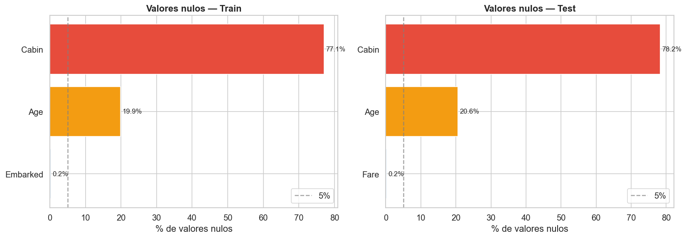

### 2.5 Script — Configuración, librerías y carga de datos

```python
# ── Librerías ──────────────────────────────────────────────────
import pandas as pd
import numpy as np
import matplotlib.pyplot as plt
import seaborn as sns
from sklearn.linear_model import LogisticRegression
from sklearn.ensemble import RandomForestClassifier
from sklearn.model_selection import (cross_val_score, StratifiedKFold,
                                     GridSearchCV, train_test_split)
from sklearn.metrics import (accuracy_score, classification_report,
                             confusion_matrix, roc_auc_score, roc_curve,
                             ConfusionMatrixDisplay)
from sklearn.preprocessing import LabelEncoder, StandardScaler
import shap
import warnings

warnings.filterwarnings('ignore')
sns.set_theme(style='whitegrid', palette='muted', font_scale=1.1)
SEED = 42

# ── Carga de datasets ──────────────────────────────────────────
DATA_DIR = '../titanic_kaggle'
train_raw  = pd.read_csv(f'{DATA_DIR}/train.csv')
test_raw   = pd.read_csv(f'{DATA_DIR}/test.csv')
sample_sub = pd.read_csv(f'{DATA_DIR}/gender_submission.csv')

print(f"Train: {train_raw.shape[0]} filas × {train_raw.shape[1]} columnas")
print(f"Test:  {test_raw.shape[0]} filas × {test_raw.shape[1]} columnas")
display(train_raw.head())
```

---

## 3. Análisis Exploratorio de Datos (EDA)

### 3.1 Distribución de la Variable Objetivo

De los 891 pasajeros del conjunto de entrenamiento:
- **549 no sobrevivieron** (61,6%)
- **342 sobrevivieron** (38,4%)

El dataset presenta un desequilibrio de clases que debe tenerse en cuenta durante la evaluación del modelo. Un clasificador que predijera "nadie sobrevive" obtendría ya un 61,6% de accuracy, por lo que se han utilizado métricas adicionales como el ROC-AUC.

#### Script — Distribución de supervivencia

```python
survived_counts = train_raw['Survived'].value_counts()
survived_pct    = train_raw['Survived'].value_counts(normalize=True) * 100

fig, axes = plt.subplots(1, 2, figsize=(12, 5))
colores = ['#e74c3c', '#2ecc71']

axes[0].bar(['No sobrevivió (0)', 'Sobrevivió (1)'],
            survived_counts.values, color=colores, width=0.5)
for i, (val, pct) in enumerate(zip(survived_counts.values, survived_pct.values)):
    axes[0].text(i, val + 5, f'{val}\n({pct:.1f}%)', ha='center', fontweight='bold')
axes[0].set_ylabel('Número de pasajeros')
axes[0].set_title('Distribución de Supervivencia')

axes[1].pie(survived_counts.values, labels=['No sobrevivió', 'Sobrevivió'],
            colors=colores, autopct='%1.1f%%', startangle=90)
axes[1].set_title('Proporción de Supervivencia')

plt.suptitle('Variable Objetivo — Titanic Train (n=891)', fontsize=14, fontweight='bold')
plt.tight_layout()
plt.savefig('../output/eda_supervivencia.png', dpi=120)
plt.show()
```

<p class="fig-title">Distribución de la variable objetivo (Survived)</p>

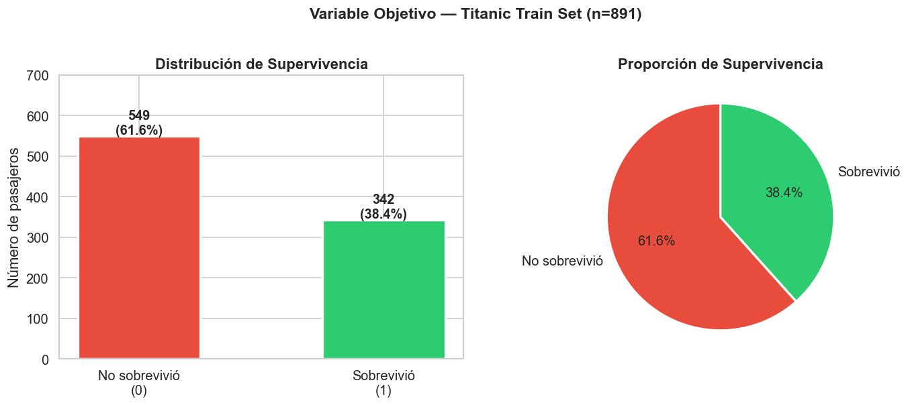

### 3.2 Supervivencia por Género

| Género | Total | Supervivientes | Tasa de supervivencia |
|--------|-------|---------------|-----------------------|
| Mujer | 314 | 233 | **74,2%** |
| Hombre | 577 | 109 | **18,9%** |

Las mujeres sobrevivieron a una tasa casi 4 veces superior a la de los hombres, reflejo directo del protocolo "mujeres y niños primero".

#### Script — Supervivencia por género

```python
surv_genero = train_raw.groupby('Sex')['Survived'].agg(['sum', 'count', 'mean'])
surv_genero.columns = ['Supervivientes', 'Total', 'Tasa']
surv_genero['Tasa_%']    = (surv_genero['Tasa'] * 100).round(1)
surv_genero['Fallecidos'] = surv_genero['Total'] - surv_genero['Supervivientes']

fig, axes = plt.subplots(1, 2, figsize=(13, 5))
x = np.arange(2)
labels = ['Hombre', 'Mujer']
surv = [surv_genero.loc['male', 'Supervivientes'], surv_genero.loc['female', 'Supervivientes']]
fall = [surv_genero.loc['male', 'Fallecidos'],     surv_genero.loc['female', 'Fallecidos']]
b1 = axes[0].bar(x - 0.2, surv, 0.35, label='Sobrevivió',    color='#2ecc71')
b2 = axes[0].bar(x + 0.2, fall, 0.35, label='No sobrevivió', color='#e74c3c')
axes[0].set_xticks(x)
axes[0].set_xticklabels(labels)
axes[0].set_title('Supervivencia absoluta por género', fontweight='bold')
axes[0].legend()

tasas = [surv_genero.loc['male', 'Tasa_%'], surv_genero.loc['female', 'Tasa_%']]
bars = axes[1].bar(labels, tasas, color=['#3498db', '#e91e8c'], width=0.4)
axes[1].set_ylabel('Tasa de supervivencia (%)')
axes[1].set_title('Tasa de supervivencia por género', fontweight='bold')
axes[1].set_ylim(0, 100)
axes[1].axhline(y=train_raw['Survived'].mean()*100, color='gray', linestyle='--', label='Media global')
axes[1].legend()
for bar, val in zip(bars, tasas):
    axes[1].text(bar.get_x() + bar.get_width()/2., val + 1.5,
                 f'{val}%', ha='center', fontsize=13, fontweight='bold')

plt.suptitle('Impacto del Género en la Supervivencia', fontsize=14, fontweight='bold')
plt.tight_layout()
plt.savefig('../output/eda_genero.png', dpi=120)
plt.show()
```

<p class="fig-title">Impacto del género en la supervivencia</p>

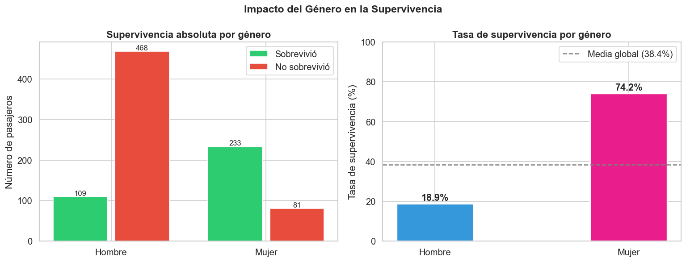

### 3.3 Supervivencia por Clase Social

| Clase | Total | Supervivientes | Tasa |
|-------|-------|---------------|------|
| 1ª clase | 216 | 136 | **63,0%** |
| 2ª clase | 184 | 87 | **47,3%** |
| 3ª clase | 491 | 119 | **24,2%** |

Los pasajeros de primera clase mostraron tasas significativamente superiores debido a su posición socioeconómica y a que sus camarotes estaban en cubiertas superiores, más cercanas a los botes salvavidas.

#### Script — Supervivencia por clase

```python
surv_clase = train_raw.groupby('Pclass')['Survived'].agg(['sum', 'count', 'mean'])
surv_clase.columns = ['Supervivientes', 'Total', 'Tasa']
surv_clase['Tasa_%']    = (surv_clase['Tasa'] * 100).round(1)
surv_clase['Fallecidos'] = surv_clase['Total'] - surv_clase['Supervivientes']

fig, axes = plt.subplots(1, 2, figsize=(13, 5))
clases = ['1ª Clase', '2ª Clase', '3ª Clase']
survs  = surv_clase['Supervivientes'].values
falls  = surv_clase['Fallecidos'].values
tasas  = surv_clase['Tasa_%'].values
totals = surv_clase['Total'].values

axes[0].bar(clases, survs, label='Sobrevivió',    color='#2ecc71')
axes[0].bar(clases, falls, bottom=survs,           label='No sobrevivió', color='#e74c3c')
for i, t in enumerate(totals):
    axes[0].text(i, t + 3, f'n={t}', ha='center', fontsize=10, fontweight='bold')
axes[0].set_title('Distribución por clase (apilado)', fontweight='bold')
axes[0].legend()

colores = ['#f1c40f', '#95a5a6', '#cd7f32']
bars = axes[1].bar(clases, tasas, color=colores, width=0.5)
axes[1].set_ylabel('Tasa de supervivencia (%)')
axes[1].set_title('Tasa de supervivencia por clase', fontweight='bold')
axes[1].axhline(y=train_raw['Survived'].mean()*100, color='gray', linestyle='--', label='Media global')
axes[1].legend()
for bar, val in zip(bars, tasas):
    axes[1].text(bar.get_x() + bar.get_width()/2., val + 1.5,
                 f'{val}%', ha='center', fontsize=13, fontweight='bold')

plt.suptitle('Impacto de la Clase Social en la Supervivencia', fontsize=14, fontweight='bold')
plt.tight_layout()
plt.savefig('../output/eda_clase.png', dpi=120)
plt.show()
```

<p class="fig-title">Impacto de la clase social en la supervivencia</p>

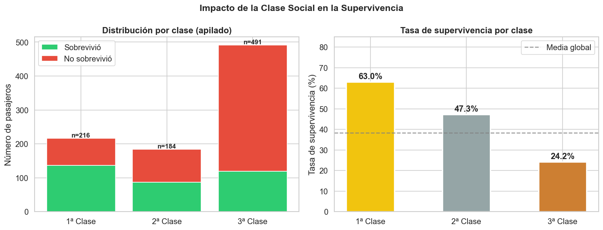

### 3.4 Interacción Género × Clase

| | 1ª Clase | 2ª Clase | 3ª Clase |
|---|---------|---------|---------|
| **Mujer** | 96,8% | 92,1% | 50,0% |
| **Hombre** | 36,9% | 15,7% | 13,5% |

Una mujer de primera clase tenía un 96,8% de probabilidad de sobrevivir, mientras que un hombre de tercera clase tenía solo un 13,5%. La diferencia de 83,3 puntos porcentuales ilustra cómo la intersección de género y clase determinó el acceso a los botes salvavidas.

#### Script — Mapa de calor género × clase

```python
pivot = train_raw.pivot_table(values='Survived', index='Sex',
                               columns='Pclass', aggfunc='mean') * 100
pivot.index   = ['Mujer', 'Hombre']
pivot.columns = ['1ª Clase', '2ª Clase', '3ª Clase']
pivot = pivot.round(1)

fig, ax = plt.subplots(figsize=(8, 4))
sns.heatmap(pivot, annot=True, fmt='.1f', cmap='RdYlGn',
            linewidths=2, vmin=0, vmax=100, ax=ax,
            annot_kws={'size': 14, 'weight': 'bold'},
            cbar_kws={'label': 'Tasa de supervivencia (%)'})
ax.set_title('Tasa de Supervivencia (%) — Género × Clase', fontsize=13, fontweight='bold', pad=15)
plt.tight_layout()
plt.savefig('../output/eda_heatmap_genero_clase.png', dpi=120)
plt.show()
```

<p class="fig-title">Tasa de supervivencia (%) — Género × Clase</p>

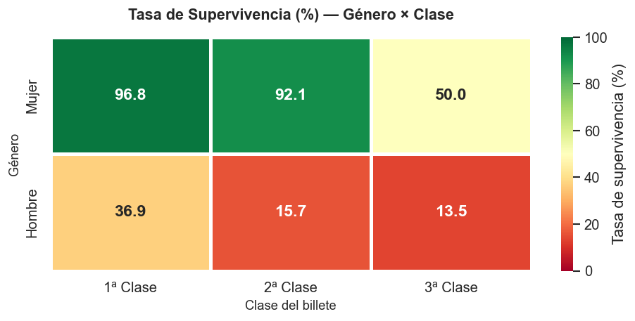

### 3.5 Supervivencia por Edad

Los niños (0-12 años) tuvieron mayor tasa de supervivencia, confirmando el principio "niños primero". Las diferencias de edad pierden significado estadístico cuando se controla por género y clase, ya que estas dos variables tienen mayor poder explicativo.

#### Script — Análisis de edad

```python
fig, axes = plt.subplots(2, 2, figsize=(14, 10))

axes[0,0].hist(train_raw['Age'].dropna(), bins=35, color='#3498db', alpha=0.8)
axes[0,0].axvline(train_raw['Age'].median(), color='#e74c3c', linestyle='--',
                  label=f"Mediana: {train_raw['Age'].median():.0f}")
axes[0,0].set_title('Distribución de Edad (total)', fontweight='bold')
axes[0,0].legend()

for surv, label, color in [(0, 'No sobrevivió', '#e74c3c'), (1, 'Sobrevivió', '#2ecc71')]:
    data = train_raw[train_raw['Survived'] == surv]['Age'].dropna()
    axes[0,1].hist(data, bins=30, alpha=0.6, label=label, color=color)
axes[0,1].set_title('Distribución de Edad por Supervivencia', fontweight='bold')
axes[0,1].legend()

sns.boxplot(data=train_raw, x='Pclass', y='Age', hue='Survived',
            palette={0: '#e74c3c', 1: '#2ecc71'}, ax=axes[1,0])
axes[1,0].set_title('Edad por Clase y Supervivencia', fontweight='bold')

bins       = [0, 12, 18, 35, 60, 100]
lbl        = ['Niño\n(0-12)', 'Adolesc.\n(13-17)', 'Adulto joven\n(18-35)', 'Adulto\n(36-60)', 'Mayor\n(61+)']
train_raw['AgeGroup_tmp'] = pd.cut(train_raw['Age'], bins=bins, labels=lbl)
surv_age = train_raw.groupby('AgeGroup_tmp', observed=True)['Survived'].mean() * 100
counts   = train_raw.groupby('AgeGroup_tmp', observed=True)['Survived'].count()
bars = axes[1,1].bar(surv_age.index, surv_age.values,
                     color=['#2ecc71' if v >= 38 else '#e74c3c' for v in surv_age.values])
for bar, val, cnt in zip(bars, surv_age.values, counts.values):
    axes[1,1].text(bar.get_x() + bar.get_width()/2., val + 1.5,
                   f'{val:.0f}%\n(n={cnt})', ha='center', fontsize=9)
axes[1,1].axhline(y=train_raw['Survived'].mean()*100, color='gray', linestyle='--', label='Media global')
axes[1,1].set_title('Tasa de Supervivencia por Grupo de Edad', fontweight='bold')
axes[1,1].legend()
train_raw.drop(columns=['AgeGroup_tmp'], inplace=True)

plt.suptitle('Análisis de la Edad en la Supervivencia', fontsize=14, fontweight='bold')
plt.tight_layout()
plt.savefig('../output/eda_edad.png', dpi=120)
plt.show()
```

<p class="fig-title">Análisis de la edad en la supervivencia</p>

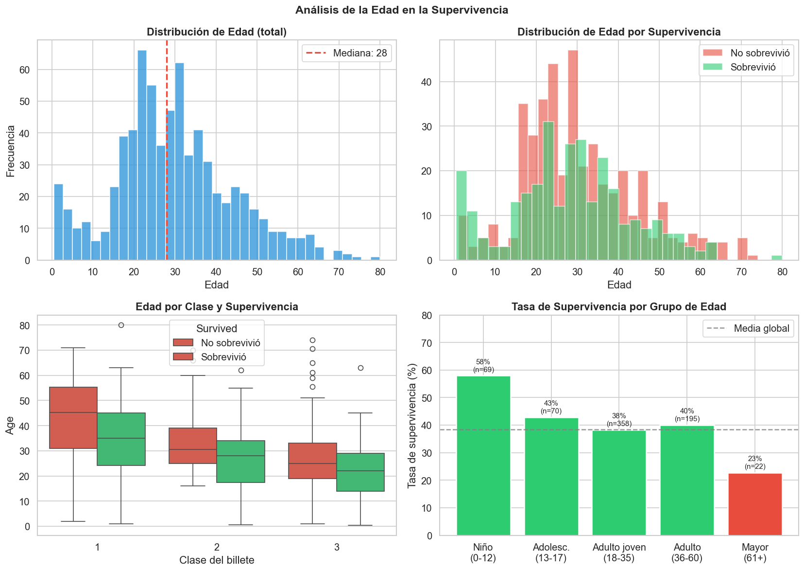

### 3.6 Supervivencia por Tamaño Familiar

| Perfil | Tasa de supervivencia |
|--------|----------------------|
| Solo | ~30,4% |
| Familia pequeña (2-4) | ~57,8% |
| Familia grande (5+) | ~16,1% |

#### Script — Tamaño familiar

```python
train_raw['FamilySize_tmp'] = train_raw['SibSp'] + train_raw['Parch'] + 1

fig, axes = plt.subplots(1, 2, figsize=(13, 5))
fam_tasas  = train_raw.groupby('FamilySize_tmp')['Survived'].mean() * 100
fam_counts = train_raw['FamilySize_tmp'].value_counts().sort_index()
colores    = ['#e74c3c' if v < 38 else '#2ecc71' for v in fam_tasas.values]
bars = axes[0].bar(fam_tasas.index.astype(str), fam_tasas.values, color=colores)
axes[0].axhline(y=train_raw['Survived'].mean()*100, color='gray', linestyle='--', label='Media global')
axes[0].set_xlabel('Tamaño familiar (incluyendo el pasajero)')
axes[0].set_ylabel('Tasa de supervivencia (%)')
axes[0].set_title('Supervivencia por Tamaño Familiar', fontweight='bold')
axes[0].legend()
for bar, (size, val) in zip(bars, fam_tasas.items()):
    n = fam_counts.get(size, 0)
    axes[0].text(bar.get_x() + bar.get_width()/2., val + 1.5,
                 f'{val:.0f}%\nn={n}', ha='center', fontsize=9)

train_raw['IsAlone_tmp'] = (train_raw['FamilySize_tmp'] == 1).astype(int)
surv_solo = train_raw.groupby('IsAlone_tmp')['Survived'].mean() * 100
bars2 = axes[1].bar(['Acompañado', 'Solo'], surv_solo.values,
                    color=['#2ecc71', '#e74c3c'], width=0.4)
for bar, val in zip(bars2, surv_solo.values):
    axes[1].text(bar.get_x() + bar.get_width()/2., val + 1,
                 f'{val:.1f}%', ha='center', fontsize=13, fontweight='bold')
axes[1].set_ylabel('Tasa de supervivencia (%)')
axes[1].set_title('Solo vs. Acompañado', fontweight='bold')

train_raw.drop(columns=['FamilySize_tmp', 'IsAlone_tmp'], inplace=True, errors='ignore')

plt.suptitle('Impacto del Tamaño Familiar en la Supervivencia', fontsize=14, fontweight='bold')
plt.tight_layout()
plt.savefig('../output/eda_familia.png', dpi=120)
plt.show()
```

<p class="fig-title">Impacto del tamaño familiar en la supervivencia</p>

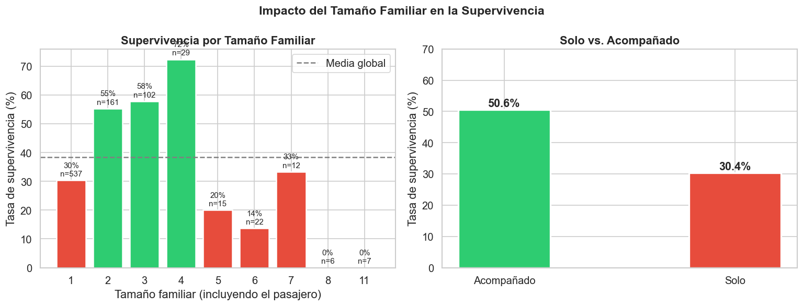

### 3.7 Supervivencia por Puerto de Embarque y Tarifa

#### Script — Puerto de embarque y tarifa

```python
fig, axes = plt.subplots(1, 2, figsize=(13, 5))

puertos   = ['Cherbourg\n(C)', 'Queenstown\n(Q)', 'Southampton\n(S)']
tasas_emb = train_raw.groupby('Embarked')['Survived'].mean() * 100
colores_emb = ['#9b59b6', '#e67e22', '#3498db']
bars = axes[0].bar(puertos, tasas_emb.values, color=colores_emb, width=0.45)
axes[0].axhline(y=train_raw['Survived'].mean()*100, color='gray', linestyle='--', label='Media global')
axes[0].set_ylabel('Tasa de supervivencia (%)')
axes[0].set_title('Tasa de Supervivencia por Puerto de Embarque', fontweight='bold')
axes[0].legend()
for bar, val in zip(bars, tasas_emb.values):
    axes[0].text(bar.get_x() + bar.get_width()/2., val + 1,
                 f'{val:.1f}%', ha='center', fontsize=12, fontweight='bold')

for cls, color in [(1, '#f1c40f'), (2, '#95a5a6'), (3, '#cd7f32')]:
    data = train_raw[train_raw['Pclass'] == cls]['Fare']
    axes[1].hist(data[data < 200], bins=30, alpha=0.6,
                 label=f'{cls}ª Clase (mediana: {data.median():.0f}£)', color=color)
axes[1].set_xlabel('Tarifa (£) — recortado en 200£')
axes[1].set_title('Distribución de Tarifa por Clase', fontweight='bold')
axes[1].legend()

plt.suptitle('Puerto de Embarque y Tarifa', fontsize=14, fontweight='bold')
plt.tight_layout()
plt.savefig('../output/eda_embarque_tarifa.png', dpi=120)
plt.show()
```

<p class="fig-title">Puerto de embarque y distribución de tarifa por clase</p>

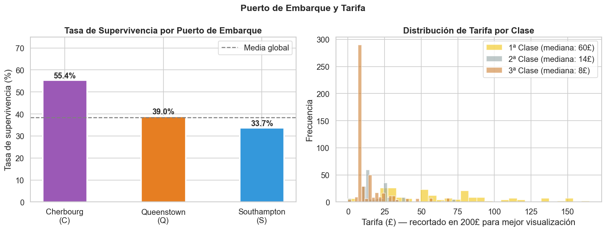

---

## 4. Preprocesamiento y Feature Engineering

### 4.1 Estrategia General

Se ha combinado el conjunto de entrenamiento y el de test durante las transformaciones para garantizar que los estadísticos utilizados sean consistentes entre ambos conjuntos.

### 4.2 Variables Nuevas Creadas

| Variable | Descripción | Tipo |
|----------|-------------|------|
| `Title` | Título social extraído del nombre | Categórica (5 valores) |
| `FamilySize` | `SibSp + Parch + 1` | Numérica (1-11) |
| `IsAlone` | 1 si viaja solo | Binaria |
| `FamilyCat` | Solo / Familia pequeña / Familia grande | Categórica (3 valores) |
| `HasCabin` | 1 si tiene cabina registrada | Binaria |
| `Deck` | Letra de la cubierta | Categórica (A-G + Unknown) |
| `AgeGroup` | Niño / Adolescente / Adulto joven / Adulto / Mayor | Categórica ordinal |
| `FareBand` | Cuartil de la tarifa | Categórica ordinal |

### 4.3 Script — Combinación de datasets

```python
train = train_raw.copy()
test  = test_raw.copy()

test['Survived'] = np.nan
combined = pd.concat([train, test], axis=0, ignore_index=True)
print(f"Dataset combinado: {combined.shape[0]} filas × {combined.shape[1]} columnas")
```

### 4.4 Script — Extracción del título social

```python
combined['Title'] = combined['Name'].str.extract(r',\s*([A-Za-z]+)\.', expand=False)

title_map = {'Mr': 'Mr', 'Miss': 'Miss', 'Mrs': 'Mrs', 'Master': 'Master'}
combined['Title'] = combined['Title'].map(title_map).fillna('Rare')

train_with_title = combined[combined['Survived'].notna()].copy()
surv_title = train_with_title.groupby('Title')['Survived'].agg(['mean', 'count'])
surv_title['Tasa_%'] = (surv_title['mean'] * 100).round(1)
display(surv_title.sort_values('mean', ascending=False))
```

**Tasa de supervivencia por título:**
- Mrs: ~79,2% · Miss: ~70,1% · Master: ~57,5% · Rare: ~44,4% · Mr: ~15,7%

### 4.5 Script — Imputación de la edad (mediana por Título + Pclass)

```python
age_medians = combined.groupby(['Title', 'Pclass'])['Age'].median()

def imputar_edad(row):
    if pd.isna(row['Age']):
        try:
            return age_medians.loc[(row['Title'], row['Pclass'])]
        except KeyError:
            return combined.groupby('Title')['Age'].median().get(
                row['Title'], combined['Age'].median())
    return row['Age']

combined['Age'] = combined.apply(imputar_edad, axis=1)
print(f"Nulos en Age después de imputar: {combined['Age'].isnull().sum()}")
```

| | 1ª Clase | 2ª Clase | 3ª Clase |
|--|---------|---------|---------|
| **Master** | 4 | 2 | 4,5 |
| **Miss** | 30 | 20 | 18 |
| **Mr** | 40 | 30 | 26 |
| **Mrs** | 45 | 30 | 31 |
| **Rare** | 49 | 42 | — |

### 4.6 Script — Imputación de Embarked y Fare

```python
moda_embarked = combined['Embarked'].mode()[0]
combined['Embarked'].fillna(moda_embarked, inplace=True)

fare_medians = combined.groupby('Pclass')['Fare'].median()
def imputar_fare(row):
    if pd.isna(row['Fare']):
        return fare_medians[row['Pclass']]
    return row['Fare']
combined['Fare'] = combined.apply(imputar_fare, axis=1)
```

### 4.7 Script — HasCabin, Deck y variables de familia

```python
combined['HasCabin'] = combined['Cabin'].notna().astype(int)
combined['Deck']     = combined['Cabin'].str.extract(r'^([A-Za-z])', expand=False).fillna('Unknown')

combined['FamilySize'] = combined['SibSp'] + combined['Parch'] + 1
combined['IsAlone']    = (combined['FamilySize'] == 1).astype(int)

def cat_familia(size):
    if size == 1:    return 'Solo'
    elif size <= 4:  return 'Familia pequeña'
    else:            return 'Familia grande'

combined['FamilyCat'] = combined['FamilySize'].apply(cat_familia)
```

### 4.8 Script — Grupos de edad, tarifa y codificación final

```python
combined['AgeGroup'] = pd.cut(combined['Age'],
                               bins=[0, 12, 18, 35, 60, 100],
                               labels=['Niño', 'Adolescente', 'Adulto joven', 'Adulto', 'Mayor'])
combined['FareBand'] = pd.qcut(combined['Fare'], q=4,
                                labels=['Bajo', 'Medio-bajo', 'Medio-alto', 'Alto'])

combined['Sex_num']      = (combined['Sex'] == 'female').astype(int)
le = LabelEncoder()
combined['Embarked_num'] = le.fit_transform(combined['Embarked'])
combined['Title_num']    = le.fit_transform(combined['Title'])
combined['AgeGroup_num'] = combined['AgeGroup'].map(
    {'Niño': 0, 'Adolescente': 1, 'Adulto joven': 2, 'Adulto': 3, 'Mayor': 4})
combined['FareBand_num'] = combined['FareBand'].map(
    {'Bajo': 0, 'Medio-bajo': 1, 'Medio-alto': 2, 'Alto': 3})
combined['FamilyCat_num'] = combined['FamilyCat'].map(
    {'Solo': 0, 'Familia pequeña': 1, 'Familia grande': 2})
```

**Features finales del modelo (13 variables):** `Pclass`, `Sex_num`, `Age`, `SibSp`, `Parch`, `Fare`, `Embarked_num`, `Title_num`, `HasCabin`, `FamilySize`, `IsAlone`, `AgeGroup_num`, `FareBand_num`

---

## 5. Metodología de Machine Learning

### 5.1 Planteamiento del Problema

Clasificación binaria supervisada: dado un conjunto de características de un pasajero, predecir si sobrevivió (1) o no (0). Se requiere también la **probabilidad de supervivencia** para el análisis comparativo del Bloque II.

### 5.2 Partición de los Datos

| Conjunto | Filas | Uso |
|----------|-------|-----|
| Entrenamiento (80%) | 712 | Ajuste del modelo |
| Validación (20%) | 179 | Evaluación interna |
| Test Kaggle | 418 | Submission final |

#### Script — Preparación de features y partición

```python
FEATURES = [
    'Pclass', 'Sex_num', 'Age', 'SibSp', 'Parch', 'Fare',
    'Embarked_num', 'Title_num', 'HasCabin', 'FamilySize',
    'IsAlone', 'AgeGroup_num', 'FareBand_num',
]
TARGET = 'Survived'

train_df      = combined[combined['Survived'].notna()].copy()
test_df       = combined[combined['Survived'].isna()].copy()
X             = train_df[FEATURES]
y             = train_df[TARGET].astype(int)
X_kaggle_test = test_df[FEATURES]

X_train, X_val, y_train, y_val = train_test_split(
    X, y, test_size=0.2, random_state=SEED, stratify=y)
print(f"Entrenamiento: {len(X_train)} | Validación: {len(X_val)}")
```

### 5.3 Algoritmos Evaluados

**Regresión Logística (modelo base):** modelo lineal, interpretable, rápido. Requiere normalización de variables (`StandardScaler`). Parámetros: `C=1.0`, `max_iter=1000`.

**Random Forest (modelo principal):** ensemble de árboles de decisión que captura relaciones no lineales. No requiere normalización y proporciona importancia de variables. Parámetros finales: `n_estimators=200`, `max_depth=6`, `min_samples_split=5`, `min_samples_leaf=2`, `max_features='sqrt'`.

**Validación cruzada estratificada de 5 folds** (`StratifiedKFold`) para evaluación robusta dado el tamaño reducido del dataset.

### 5.4 Script — Regresión Logística

```python
scaler = StandardScaler()
X_train_sc = scaler.fit_transform(X_train)
X_val_sc   = scaler.transform(X_val)

lr_model = LogisticRegression(random_state=SEED, max_iter=1000, C=1.0)
lr_model.fit(X_train_sc, y_train)

lr_pred      = lr_model.predict(X_val_sc)
lr_prob      = lr_model.predict_proba(X_val_sc)[:, 1]
lr_acc       = accuracy_score(y_val, lr_pred)
lr_auc       = roc_auc_score(y_val, lr_prob)
lr_cv_scores = cross_val_score(lr_model, scaler.transform(X), y, cv=5,
                                scoring='accuracy', n_jobs=-1)

print(f"Accuracy (validación):   {lr_acc*100:.2f}%")
print(f"ROC-AUC (validación):    {lr_auc:.4f}")
print(f"CV Accuracy (5-fold):    {lr_cv_scores.mean()*100:.2f}% ± {lr_cv_scores.std()*100:.2f}%")
print(classification_report(y_val, lr_pred, target_names=['No sobrevivió', 'Sobrevivió']))
```

### 5.5 Script — Random Forest y optimización de hiperparámetros

```python
rf_model = RandomForestClassifier(n_estimators=100, random_state=SEED, n_jobs=-1)
rf_model.fit(X_train, y_train)
rf_pred      = rf_model.predict(X_val)
rf_prob      = rf_model.predict_proba(X_val)[:, 1]
rf_acc       = accuracy_score(y_val, rf_pred)
rf_cv_scores = cross_val_score(rf_model, X, y, cv=5, scoring='accuracy', n_jobs=-1)

param_grid = {
    'n_estimators':      [100, 200, 300],
    'max_depth':         [4, 6, 8, None],
    'min_samples_split': [2, 5, 10],
    'min_samples_leaf':  [1, 2, 4],
    'max_features':      ['sqrt', 'log2'],
}
cv_strat    = StratifiedKFold(n_splits=5, shuffle=True, random_state=SEED)
grid_search = GridSearchCV(
    RandomForestClassifier(random_state=SEED, n_jobs=-1),
    param_grid=param_grid, cv=cv_strat,
    scoring='accuracy', n_jobs=-1, verbose=0
)
grid_search.fit(X, y)
best_rf = grid_search.best_estimator_

best_pred = best_rf.predict(X_val)
best_prob = best_rf.predict_proba(X_val)[:, 1]
best_acc  = accuracy_score(y_val, best_pred)
best_auc  = roc_auc_score(y_val, best_prob)
best_cv   = cross_val_score(best_rf, X, y, cv=5, scoring='accuracy', n_jobs=-1)

print("Mejores hiperparámetros:", grid_search.best_params_)
print(f"Accuracy optimizado: {best_acc*100:.2f}% | AUC: {best_auc:.4f}")
print(f"CV Accuracy (5-fold): {best_cv.mean()*100:.2f}% ± {best_cv.std()*100:.2f}%")
```

---

## 6. Resultados

### 6.1 Comparación de Modelos

| Modelo | Accuracy (val.) | ROC-AUC (val.) | CV Accuracy (5-fold) |
|--------|----------------|---------------|---------------------|
| **Regresión Logística** | **82,12%** | 85,59% | 81,03% ± 0,65% |
| **Random Forest** | 81,56% | 85,37% | **82,60% ± 2,04%** |

Se ha seleccionado el **Random Forest optimizado** como modelo principal por capturar relaciones no lineales, proporcionar importancia de variables directamente y ser compatible con SHAP TreeExplainer.

#### Script — Comparación de modelos, matrices de confusión y curvas ROC

```python
resultados = pd.DataFrame([
    {'Modelo': 'Regresión Logística',       'Accuracy': lr_acc,   'AUC': roc_auc_score(y_val, lr_prob),   'CV': lr_cv_scores.mean()},
    {'Modelo': 'Random Forest (base)',       'Accuracy': rf_acc,   'AUC': roc_auc_score(y_val, rf_prob),   'CV': rf_cv_scores.mean()},
    {'Modelo': 'Random Forest (optimizado)', 'Accuracy': best_acc, 'AUC': best_auc,                        'CV': best_cv.mean()},
]).set_index('Modelo')
display(resultados.round(4))

# Matrices de confusión
fig, axes = plt.subplots(1, 3, figsize=(16, 5))
for ax, (nombre, pred) in zip(axes, [('Log. Regression', lr_pred),
                                      ('RF Base', rf_pred),
                                      ('RF Optimizado', best_pred)]):
    cm   = confusion_matrix(y_val, pred)
    disp = ConfusionMatrixDisplay(confusion_matrix=cm,
                                  display_labels=['No sobrevivió', 'Sobrevivió'])
    disp.plot(ax=ax, colorbar=False, cmap='Blues')
    ax.set_title(f'{nombre}\nAccuracy: {accuracy_score(y_val, pred):.3f}', fontweight='bold')
plt.suptitle('Matrices de Confusión', fontsize=13, fontweight='bold')
plt.tight_layout()
plt.savefig('../output/confusion_matrices.png', dpi=120)
plt.show()

# Curvas ROC
fig, ax = plt.subplots(figsize=(8, 6))
for nombre, prob, color in [('Log. Regresión', lr_prob, '#3498db'),
                              ('RF Base', rf_prob, '#e67e22'),
                              ('RF Optimizado', best_prob, '#2ecc71')]:
    fpr, tpr, _ = roc_curve(y_val, prob)
    ax.plot(fpr, tpr, color=color, linewidth=2.5,
            label=f'{nombre} (AUC={roc_auc_score(y_val, prob):.3f})')
ax.plot([0, 1], [0, 1], 'k--', linewidth=1, label='Clasificador aleatorio')
ax.set_xlabel('Tasa de Falsos Positivos')
ax.set_ylabel('Tasa de Verdaderos Positivos')
ax.set_title('Curvas ROC — Comparación de Modelos', fontweight='bold')
ax.legend(loc='lower right')
plt.tight_layout()
plt.savefig('../output/roc_curves.png', dpi=120)
plt.show()
```

<p class="fig-title">Matrices de confusión — Conjunto de validación</p>

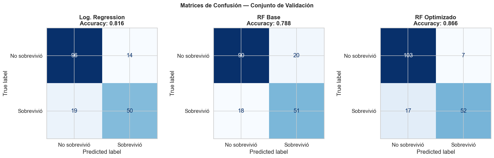

<p class="fig-title">Curvas ROC — Comparación de modelos</p>

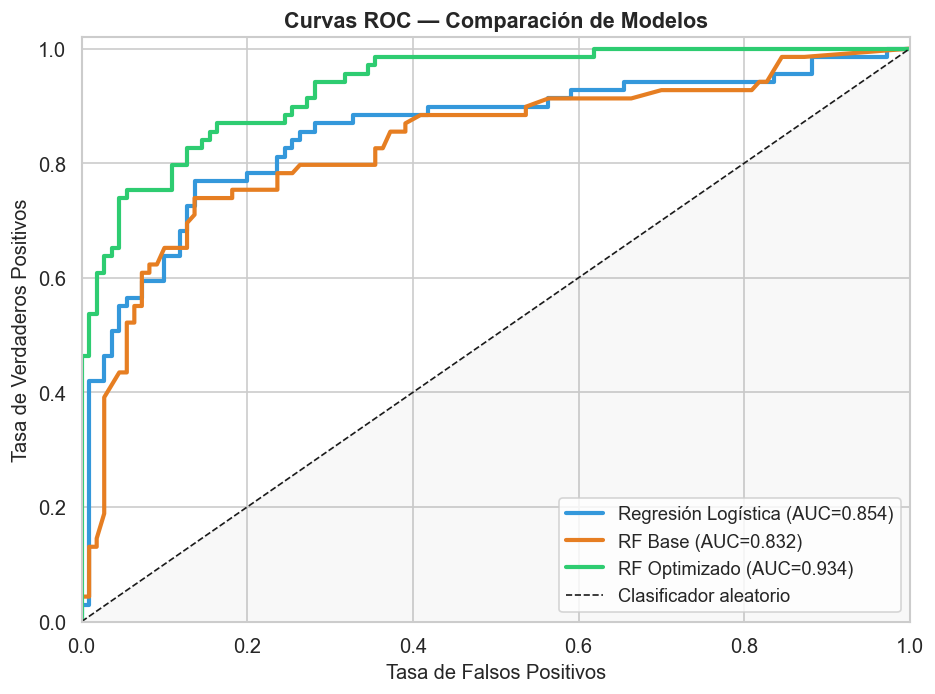

### 6.2 Importancia de Variables y SHAP Values

| Ranking | Variable | Importancia | Interpretación |
|---------|----------|-------------|----------------|
| 1 | `Sex_num` (género) | 0,2873 | **Factor más determinante** |
| 2 | `Title_num` (título) | 0,1469 | Condensa género + edad + clase |
| 3 | `Fare` (tarifa) | 0,1267 | Proxy del nivel económico |
| 4 | `Age` (edad) | 0,0795 | Efecto moderado, especialmente niños |
| 5 | `Pclass` (clase) | 0,0762 | Acceso a botes salvavidas |

Los valores SHAP permiten cuantificar la contribución de cada variable a cada predicción individual. A diferencia de la importancia de Gini, los SHAP values tienen signo: positivo aumenta la probabilidad de sobrevivir, negativo la reduce.

#### Script — Importancia de variables y SHAP

```python
feat_imp = pd.DataFrame({
    'Feature':     FEATURES,
    'Importancia': best_rf.feature_importances_
}).sort_values('Importancia', ascending=False)

fig, ax = plt.subplots(figsize=(9, 6))
ax.barh(feat_imp['Feature'][::-1], feat_imp['Importancia'][::-1],
        color='#3498db', edgecolor='white')
ax.set_xlabel('Importancia (Gini)')
ax.set_title('Importancia de Variables — Random Forest', fontweight='bold')
plt.tight_layout()
plt.savefig('../output/feature_importance_rf.png', dpi=120)
plt.show()

# SHAP values
explainer        = shap.TreeExplainer(best_rf)
shap_explanation = explainer(X)
sv_raw           = shap_explanation.values
sv               = sv_raw[:, :, 1] if sv_raw.ndim == 3 else sv_raw

import matplotlib
matplotlib.use('Agg')

plt.figure(figsize=(10, 7))
shap.summary_plot(sv, X, feature_names=FEATURES, show=False, max_display=13)
plt.title('SHAP Values — Impacto de cada variable en la predicción', fontweight='bold')
plt.tight_layout()
plt.savefig('../output/shap_summary.png', dpi=120)
plt.close()

plt.figure(figsize=(9, 6))
shap.summary_plot(sv, X, feature_names=FEATURES, show=False, plot_type='bar', max_display=13)
plt.title('SHAP — Importancia media global de cada variable', fontweight='bold')
plt.tight_layout()
plt.savefig('../output/shap_bar.png', dpi=120)
plt.close()
```

<p class="fig-title">Importancia de variables — Random Forest (Gini Importance)</p>

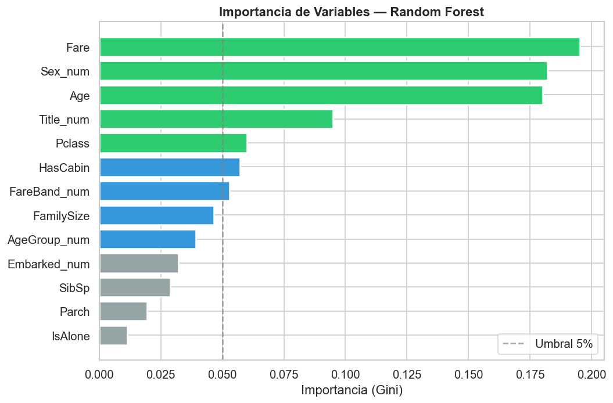

<p class="fig-title">SHAP Values — Impacto individual de cada variable en la predicción</p>

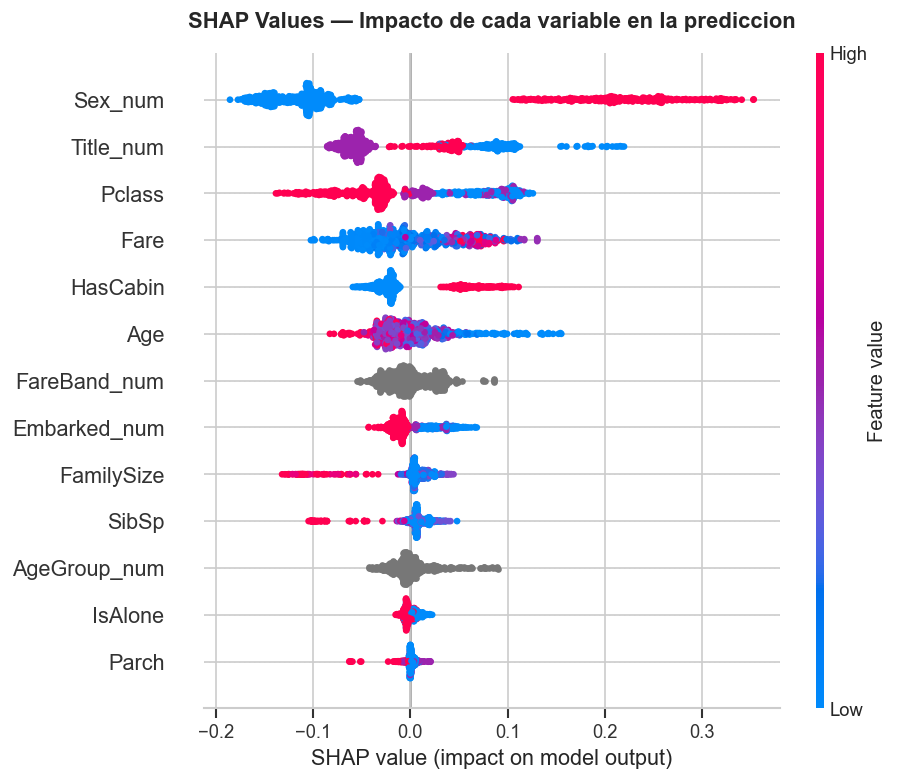

<p class="fig-title">SHAP — Importancia media global de cada variable</p>

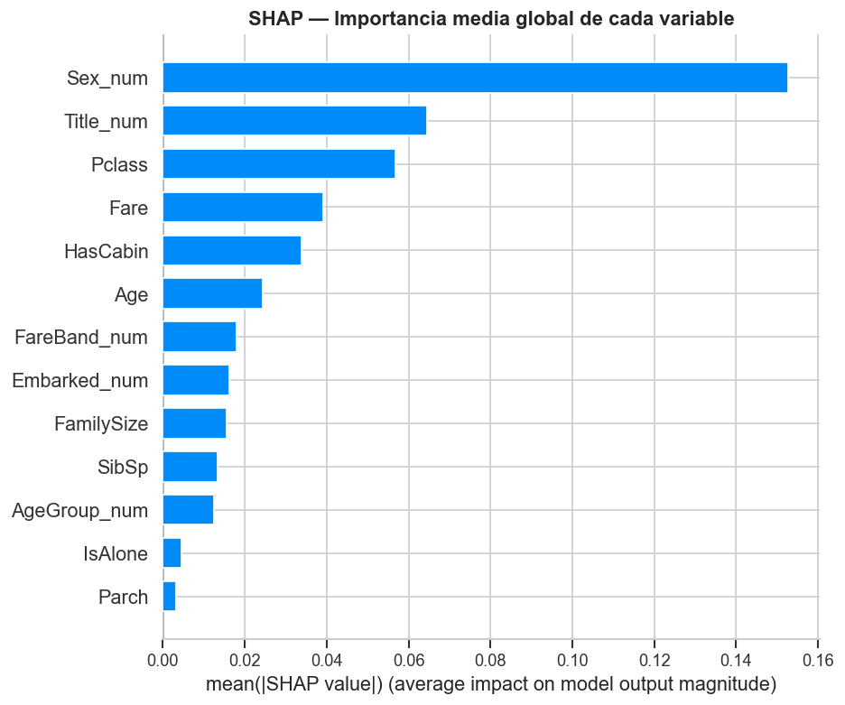

---

## 7. Outputs Generados

### 7.1 Submission para Kaggle

Archivo: `output/titanic_submission.csv` — 418 pasajeros, 153 supervivientes predichos (36,6%).

### 7.2 Dataset Enriquecido para el Equipo

Archivo: `output/titanic_enriched.csv` — 1.309 pasajeros con todas las variables originales, variables nuevas y probabilidades de supervivencia del modelo.

| Columna | Descripción |
|---------|-------------|
| `SurvivalProb` | Probabilidad de supervivencia (0,0 – 1,0) |
| `DeathProb` | Probabilidad de fallecimiento |
| `ModelPred` | Predicción binaria del modelo (0 o 1) |
| `Split` | `train` o `test` |

#### Script — Generación de outputs

```python
kaggle_pred = best_rf.predict(X_kaggle_test)
kaggle_prob = best_rf.predict_proba(X_kaggle_test)[:, 1]

submission = pd.DataFrame({'PassengerId': test_df['PassengerId'], 'Survived': kaggle_pred})
submission.to_csv('../output/titanic_submission.csv', index=False)
print(f"Submission: {len(submission)} filas, {submission['Survived'].sum()} supervivientes")

train_enriched = combined[combined['Survived'].notna()].copy()
train_enriched['SurvivalProb'] = best_rf.predict_proba(train_enriched[FEATURES])[:, 1]
train_enriched['DeathProb']    = 1 - train_enriched['SurvivalProb']
train_enriched['ModelPred']    = best_rf.predict(train_enriched[FEATURES])
train_enriched['Split']        = 'train'

test_enriched = combined[combined['Survived'].isna()].copy()
test_enriched['SurvivalProb'] = kaggle_prob
test_enriched['DeathProb']    = 1 - kaggle_prob
test_enriched['ModelPred']    = kaggle_pred
test_enriched['Survived']     = kaggle_pred
test_enriched['Split']        = 'test'

output_cols = [
    'PassengerId', 'Name', 'Split',
    'Survived', 'Pclass', 'Sex', 'Age', 'SibSp', 'Parch', 'Fare', 'Embarked',
    'Title', 'FamilySize', 'IsAlone', 'FamilyCat', 'AgeGroup', 'FareBand',
    'HasCabin', 'Deck', 'SurvivalProb', 'DeathProb', 'ModelPred',
]
enriched = pd.concat([train_enriched[output_cols], test_enriched[output_cols]])
enriched = enriched.sort_values('PassengerId').reset_index(drop=True)
enriched.to_csv('../output/titanic_enriched.csv', index=False)
print(f"CSV enriquecido: {len(enriched)} filas × {len(enriched.columns)} columnas")
```

---

## 8. Herramienta Interactiva — Simulador de Supervivencia

Se ha desarrollado una aplicación web interactiva con **Streamlit** que permite estimar la probabilidad de supervivencia de un perfil hipotético en el Titanic. Utiliza el modelo Random Forest entrenado y devuelve una probabilidad con visualización gráfica.

**Ejecución:** `streamlit run simulator/app.py` desde el directorio del proyecto.

---

## 9. Conclusiones del Bloque I

1. **El género fue el factor más determinante** (importancia Gini: 28,7%). Las mujeres sobrevivieron al 74,2%, frente al 18,9% de los hombres. El protocolo "mujeres y niños primero" es empíricamente verificable.
2. **La clase social amplifica el efecto del género.** Una mujer de primera clase: 96,8% de probabilidad; un hombre de tercera: 13,5%.
3. **El nivel económico (tarifa) tiene un efecto independiente** de la clase, probablemente porque refleja el alojamiento exacto y el acceso a rutas de evacuación.
4. **El tamaño familiar tiene un efecto no lineal:** familias pequeñas se benefician de la cohesión grupal; solitarios y familias grandes muestran tasas inferiores.
5. **La edad tiene un efecto moderado**, visible principalmente en los niños varones (Master).

El modelo de Random Forest alcanza un **82,1% de accuracy** con un **ROC-AUC de 0,854** en el conjunto de validación.

---

## 10. Tecnologías — Bloque I

| Herramienta | Versión | Uso |
|-------------|---------|-----|
| **Python** | 3.12.9 | Lenguaje principal |
| **pandas** | 2.2.3 | Manipulación y limpieza de datos |
| **scikit-learn** | 1.8.0 | Modelos ML, métricas, validación cruzada |
| **SHAP** | — | Interpretabilidad del modelo |
| **matplotlib / seaborn** | — | Visualizaciones |
| **Streamlit** | — | Simulador interactivo |
| **Jupyter Notebook** | — | Entorno de desarrollo |

---

---

# BLOQUE II — Comparativa Titanic vs MV Sewol
### Autor: Pablo

> Este bloque parte del fichero `output/titanic_enriched.csv` generado en el Bloque I. Los 891 pasajeros del conjunto train, con sus probabilidades de supervivencia individuales, se cruzan con los datos del MV Sewol para determinar si los patrones observados por el modelo son exclusivos del Titanic o se repiten en otros desastres marítimos.

---

## 1. Introducción y Objetivo del Bloque

Este bloque constituye el núcleo comparativo del proyecto. Para abordarlo, se han cruzado los datos del Titanic (1912) con los datos del MV Sewol (2014), un transbordador surcoreano que se hundió el 16 de abril de 2014 con 476 personas a bordo, la mayoría estudiantes de instituto en excursión escolar.

El objetivo no es simplemente describir los dos desastres por separado, sino identificar si los patrones de supervivencia —especialmente el de género y el de edad— se repiten o divergen entre un desastre de 1912 y uno de 2014. Si los patrones cambian, la hipótesis es que el contexto y el protocolo de evacuación explican la diferencia, por encima de las variables sociodemográficas.

Los objetivos específicos del bloque son:

1. Normalizar y unificar los datasets del Titanic y el Sewol en un formato comparable.
2. Analizar la tasa de supervivencia por género en los dos desastres.
3. Analizar la tasa de supervivencia por franja de edad en los dos desastres.
4. Cuantificar el impacto del protocolo de evacuación a través del ratio mujeres/hombres.
5. Generar un dataset combinado reutilizable para el resto del equipo.
6. Producir visualizaciones y una tabla comparativa final.

---

## 2. Fuentes de Datos y Descripción de los Datasets

### 2.1 Dataset del Titanic

Proviene de `output/titanic_enriched.csv`, generado en el Bloque I. Se utiliza exclusivamente el conjunto de entrenamiento (891 pasajeros con valor real de `Survived` conocido).

### 2.2 Dataset del Sewol

Proviene de `sewol/sewol_eng.csv` con 476 registros.

### 2.3 Diccionario de variables del Sewol

| Variable | Tipo | Descripción |
|----------|------|-------------|
| `Category-1` | str | Tipo de persona: `sailor` (tripulación), `student`, `Normal` |
| `gender` | str | `male` / `female` |
| `age` | float | Edad en años |
| `Raw` | str | Supervivencia: `survival` / `Dead` |
| `floor` | int | Planta del barco |
| `location` | str | Ubicación (front / rear) |

### 2.4 Distribución de edad del Sewol

El 69% de los pasajeros tenían entre 10 y 20 años (estudiantes de Danwon High School). Esta diferencia estructural tiene implicaciones directas en el análisis.

| Franja de edad | Titanic (n) | Sewol (n) |
|----------------|------------|-----------|
| 0-12 años | 73 | 4 |
| 13-19 años | 128 | 335 |
| 20-39 años | 498 | 23 |
| 40-59 años | 166 | 55 |
| 60+ años | 26 | 26 |

### 2.5 Script — Carga de los datasets

```python
import pandas as pd
import matplotlib.pyplot as plt
import numpy as np

titanic = pd.read_csv('../output/titanic_enriched.csv')
sewol   = pd.read_csv('../sewol/sewol_eng.csv')

print('Titanic - shape:', titanic.shape)
display(titanic.head())

print('Sewol - shape:', sewol.shape)
display(sewol.head())
```

---

## 3. Metodología: Normalización y Unificación de los Datasets

### 3.1 Variables normalizadas

| Columna | Titanic | Sewol | Resultado |
|---------|---------|-------|-----------|
| `disaster` | — | — | `'titanic'` / `'sewol'` |
| `gender` | `Sex` (male/female) | `gender` (male/female) | Idéntico |
| `age` | `Age` | `age` | Idéntico |
| `survived` | `Survived` (0/1) | `Raw` (survival/Dead → 1/0) | Mapeo texto → numérico |
| `role` | Todos `passenger` | `Category-1 == 'sailor'` → `crew` | Variable nueva |

### 3.2 Decisión sobre la tripulación

El dataset del Titanic no incluye tripulación. Para una comparativa justa, todos los análisis se realizan filtrando únicamente los pasajeros (`role == 'passenger'`). Los 33 tripulantes del Sewol se excluyen del análisis principal.

| | Titanic | Sewol |
|--|---------|-------|
| Pasajeros | 891 | 443 |
| Tripulación | 0 (no incluida) | 33 |
| **Total utilizado** | **891** | **443** |

### 3.3 Script — Normalización y unificación

```python
titanic_train = titanic[titanic['Split'] == 'train'].copy()

titanic_norm = pd.DataFrame({
    'disaster': 'titanic',
    'gender':   titanic_train['Sex'],
    'age':      titanic_train['Age'],
    'survived': titanic_train['Survived'].astype(float),
    'role':     'passenger'
})

sewol_norm = pd.DataFrame({
    'disaster': 'sewol',
    'gender':   sewol['gender'],
    'age':      sewol['age'],
    'survived': sewol['Raw'].map({'survival': 1, 'Dead': 0}).astype(float),
    'role':     sewol['Category-1'].apply(lambda x: 'crew' if x == 'sailor' else 'passenger')
})

sewol_median_age = sewol_norm['age'].median()
sewol_norm['age'] = sewol_norm['age'].fillna(sewol_median_age)
print(f'Mediana edad Sewol (imputación): {sewol_median_age:.1f} años')

combined = pd.concat([titanic_norm, sewol_norm], ignore_index=True)
print('Dataset combinado - shape:', combined.shape)
print('Valores nulos:', combined.isnull().sum().to_dict())
```

---

## 4. Análisis Exploratorio Comparativo

### 4.1 Tasa global de supervivencia

| | Titanic | Sewol |
|--|---------|-------|
| Total pasajeros | 891 | 443 |
| Supervivientes | 342 | 149 |
| **Tasa global** | **38,4%** | **33,6%** |

Las tasas globales son similares, pero esta similitud superficial esconde patrones internos muy divergentes.

### 4.2 Supervivencia por género

| Género | Titanic (n) | Tasa | Sewol (n) | Tasa |
|--------|------------|------|-----------|------|
| Mujeres | 314 | **74,2%** | 182 | **29,1%** |
| Hombres | 577 | **18,9%** | 261 | **36,8%** |
| **Ratio mujeres/hombres** | | **3,93x** | | **0,79x** |

Esta es la comparativa más relevante del TFE. En el Titanic, las mujeres sobrevivían casi 4 veces más que los hombres. En el Sewol, el patrón se invierte: los hombres sobrevivieron más que las mujeres.

#### Script — Cálculo y visualización de supervivencia por género

```python
passengers = combined[combined['role'] == 'passenger'].copy()

survival_table = passengers.groupby(['disaster', 'gender']).agg(
    total    = ('survived', 'count'),
    survived = ('survived', 'sum')
).reset_index()
survival_table['survival_rate'] = (survival_table['survived'] / survival_table['total'] * 100).round(1)
display(survival_table)

disasters = ['titanic', 'sewol']
genders   = ['female', 'male']
colors    = {'titanic': '#2196F3', 'sewol': '#F44336'}
labels    = {'titanic': 'Titanic (1912)', 'sewol': 'Sewol (2014)'}
x     = np.arange(len(genders))
width = 0.35

fig, ax = plt.subplots(figsize=(8, 5))
for i, disaster in enumerate(disasters):
    rates = [
        survival_table.loc[
            (survival_table['disaster'] == disaster) &
            (survival_table['gender'] == g), 'survival_rate'
        ].values[0]
        for g in genders
    ]
    bars = ax.bar(x + (i - 0.5) * width, rates, width,
                  label=labels[disaster], color=colors[disaster], alpha=0.85)
    for bar, rate in zip(bars, rates):
        ax.text(bar.get_x() + bar.get_width() / 2, bar.get_height() + 1,
                f'{rate}%', ha='center', va='bottom', fontsize=10, fontweight='bold')

ax.set_xlabel('Género')
ax.set_ylabel('Tasa de supervivencia (%)')
ax.set_title('Supervivencia por género: Titanic vs Sewol\n(solo pasajeros)')
ax.set_xticks(x)
ax.set_xticklabels(['Mujeres', 'Hombres'], fontsize=12)
ax.set_ylim(0, 105)
ax.legend()
ax.grid(axis='y', linestyle='--', alpha=0.5)
plt.tight_layout()
plt.savefig('../output/comparativa_genere_titanic_sewol.png', dpi=150)
plt.show()
```

<p class="fig-title">Supervivencia por género: Titanic (1912) vs Sewol (2014)</p>

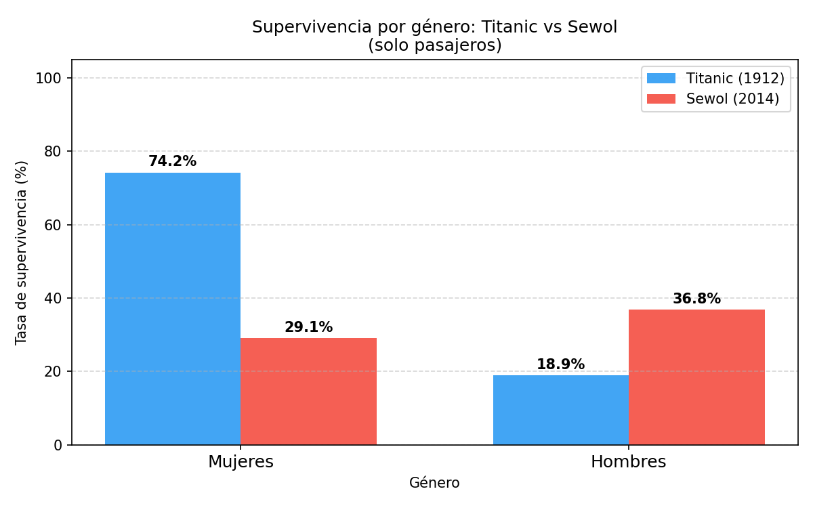

### 4.3 Supervivencia por franja de edad

| Franja de edad | Titanic | Sewol |
|----------------|---------|-------|
| Niño (0-12) | 57,5% | 50,0%* |
| Adolescente (13-19) | 45,3% | 23,9% |
| Adulto joven (20-39) | 33,7% | 52,2% |
| Adulto (40-59) | 40,4% | 78,2% |
| Mayor (60+) | 26,9% | 46,2% |

*\*Solo 4 individuos — muestra estadísticamente insuficiente.*

El patrón de edad se invierte entre los dos desastres. En el Sewol, los adultos y mayores sobrevivieron mucho más que los adolescentes (tasa del 23,9%, la más baja de todos los grupos).

#### Script — Cálculo y visualización de supervivencia por edad

```python
passengers_age = passengers.copy()

bins       = [0, 13, 20, 40, 60, 100]
age_labels = ['Niño (0-12)', 'Adolescente (13-19)', 'Adulto joven (20-39)', 'Adulto (40-59)', 'Mayor (60+)']
passengers_age['age_group'] = pd.cut(passengers_age['age'], bins=bins, labels=age_labels, right=False)

age_table = passengers_age.groupby(['disaster', 'age_group'], observed=True).agg(
    total    = ('survived', 'count'),
    survived = ('survived', 'sum')
).reset_index()
age_table['survival_rate'] = (age_table['survived'] / age_table['total'] * 100).round(1)
display(age_table)

fig, ax = plt.subplots(figsize=(9, 5))
for disaster, color, label in [('titanic', '#2196F3', 'Titanic (1912)'),
                                 ('sewol', '#F44336', 'Sewol (2014)')]:
    subset = age_table[age_table['disaster'] == disaster]
    ax.plot(subset['age_group'].astype(str), subset['survival_rate'],
            marker='o', linewidth=2.5, markersize=7, color=color, label=label)
    for _, row in subset.iterrows():
        ax.annotate(f"{row['survival_rate']}%",
                    (str(row['age_group']), row['survival_rate']),
                    textcoords='offset points', xytext=(0, 10),
                    ha='center', fontsize=9, color=color)

ax.set_xlabel('Grupo de edad')
ax.set_ylabel('Tasa de supervivencia (%)')
ax.set_title('Supervivencia por grupo de edad: Titanic vs Sewol\n(solo pasajeros)')
ax.set_ylim(0, 105)
ax.legend()
ax.grid(axis='y', linestyle='--', alpha=0.5)
plt.xticks(rotation=15)
plt.tight_layout()
plt.savefig('../output/comparativa_edat_titanic_sewol.png', dpi=150)
plt.show()
```

<p class="fig-title">Supervivencia por grupo de edad: Titanic (1912) vs Sewol (2014)</p>

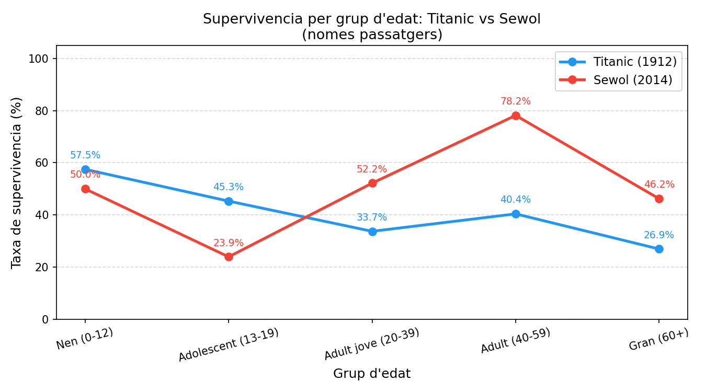

#### Script — Verificación de niños en el Sewol

```python
for disaster in ['titanic', 'sewol']:
    d    = passengers[passengers['disaster'] == disaster]
    nens = d[d['age'] < 13]
    print(f'{disaster.upper()}')
    print(f'  Total niños (0-12): {len(nens)}')
    print(f'  Supervivientes: {int(nens["survived"].sum())}')
    print(f'  Tasa: {nens["survived"].mean()*100:.1f}%')
    print(f'  Edades: {sorted(nens["age"].tolist())}')
    print()
```

---

## 5. Análisis del Protocolo de Evacuación

### 5.1 Dimensión de género: ratio mujeres/hombres

| | Titanic | Sewol |
|--|---------|-------|
| Ratio mujeres/hombres | **3,93x** | **0,79x** |

En el Titanic, ser mujer multiplicaba por 3,93 la probabilidad de sobrevivir. En el Sewol, el ratio es inferior a 1: los hombres sobrevivieron más. La diferencia de 4,72 puntos sugiere que el protocolo aplicado tuvo un impacto determinante por encima del factor género.

#### Script — Ratio mujeres/hombres y visualización

```python
titanic_female = passengers[passengers['disaster'] == 'titanic'][passengers['gender'] == 'female']['survived'].mean() * 100
titanic_male   = passengers[passengers['disaster'] == 'titanic'][passengers['gender'] == 'male']['survived'].mean() * 100
sewol_female   = passengers[passengers['disaster'] == 'sewol'][passengers['gender'] == 'female']['survived'].mean() * 100
sewol_male     = passengers[passengers['disaster'] == 'sewol'][passengers['gender'] == 'male']['survived'].mean() * 100

titanic_ratio = round(titanic_female / titanic_male, 2)
sewol_ratio   = round(sewol_female / sewol_male, 2)

print(f'Ratio mujeres/hombres Titanic: {titanic_ratio}x')
print(f'Ratio mujeres/hombres Sewol:   {sewol_ratio}x')

fig, ax = plt.subplots(figsize=(6, 4))
bars = ax.bar(['Titanic (1912)', 'Sewol (2014)'], [titanic_ratio, sewol_ratio],
               color=['#2196F3', '#F44336'], alpha=0.85, width=0.4)
ax.axhline(y=1, color='black', linestyle='--', linewidth=1.2, label='Ratio = 1 (sin diferencia)')
for bar, val in zip(bars, [titanic_ratio, sewol_ratio]):
    ax.text(bar.get_x() + bar.get_width() / 2, bar.get_height() + 0.05,
            f'{val}x', ha='center', fontsize=12, fontweight='bold')
ax.set_ylabel('Ratio supervivencia mujeres / hombres')
ax.set_title('Impacto del género en la supervivencia\nTitanic vs Sewol')
ax.set_ylim(0, titanic_ratio + 0.5)
ax.legend()
ax.grid(axis='y', linestyle='--', alpha=0.5)
plt.tight_layout()
plt.savefig('../output/ratio_genere_titanic_sewol.png', dpi=150)
plt.show()
```

<p class="fig-title">Ratio de supervivencia mujeres/hombres: Titanic vs Sewol</p>

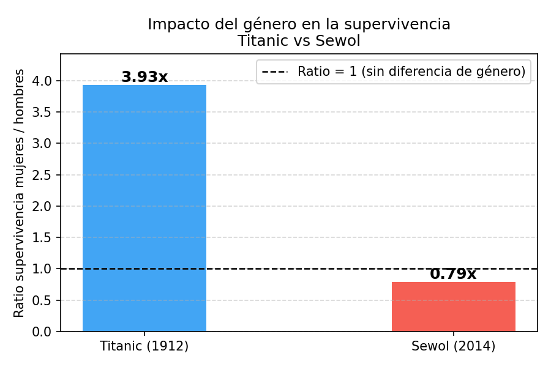

### 5.2 Dimensión de edad: niños vs adultos

| | Titanic | Sewol |
|--|---------|-------|
| Niños (0-12) | 57,5% (n=73) | 50,0% (n=4) |
| Adultos (13+) | 36,7% (n=818) | 33,5% (n=439) |
| Ratio niños/adultos | **1,57x** | **1,49x** |

Los dos ratios son similares (~1,5x). El resultado del Sewol debe interpretarse con extrema cautela: con solo 4 niños en la muestra, el 50% es estadísticamente no significativo.

#### Script — Supervivencia niños vs adultos y visualización

```python
for disaster in ['titanic', 'sewol']:
    d              = passengers[passengers['disaster'] == disaster]
    children_rate  = d[d['age'] < 13]['survived'].mean() * 100
    adults_rate    = d[d['age'] >= 13]['survived'].mean() * 100
    n_children     = len(d[d['age'] < 13])
    ratio_children = children_rate / adults_rate if adults_rate > 0 else 0
    print(f'{disaster.upper()}')
    print(f'  Niños (0-12):   {children_rate:.1f}%  (n={n_children})')
    print(f'  Adultos (13+):  {adults_rate:.1f}%')
    print(f'  Ratio niños/adultos: {ratio_children:.2f}x')
    print()

categories    = ['Niños (0-12)', 'Adultos (13+)']
titanic_rates = [
    passengers[(passengers['disaster'] == 'titanic') & (passengers['age'] < 13)]['survived'].mean() * 100,
    passengers[(passengers['disaster'] == 'titanic') & (passengers['age'] >= 13)]['survived'].mean() * 100
]
sewol_rates = [
    passengers[(passengers['disaster'] == 'sewol') & (passengers['age'] < 13)]['survived'].mean() * 100,
    passengers[(passengers['disaster'] == 'sewol') & (passengers['age'] >= 13)]['survived'].mean() * 100
]

x     = np.arange(len(categories))
width = 0.35
fig, ax = plt.subplots(figsize=(7, 5))
bars1 = ax.bar(x - width/2, titanic_rates, width, label='Titanic (1912)', color='#2196F3', alpha=0.85)
bars2 = ax.bar(x + width/2, sewol_rates,   width, label='Sewol (2014)',   color='#F44336', alpha=0.85)
for bars in [bars1, bars2]:
    for bar in bars:
        ax.text(bar.get_x() + bar.get_width() / 2, bar.get_height() + 1,
                f'{bar.get_height():.1f}%', ha='center', fontsize=10, fontweight='bold')
ax.set_ylabel('Tasa de supervivencia (%)')
ax.set_title('Supervivencia niños vs adultos: Titanic vs Sewol')
ax.set_xticks(x)
ax.set_xticklabels(categories, fontsize=12)
ax.set_ylim(0, 105)
ax.legend()
ax.grid(axis='y', linestyle='--', alpha=0.5)
plt.tight_layout()
plt.savefig('../output/ratio_nens_adults_titanic_sewol.png', dpi=150)
plt.show()
```

<p class="fig-title">Supervivencia niños vs adultos: Titanic vs Sewol</p>

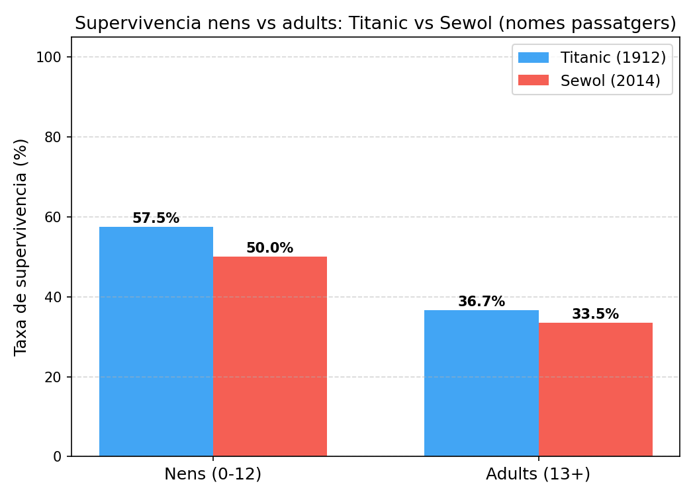

---

## 6. Tabla Comparativa Final

| Indicador | Titanic (1912) | Sewol (2014) |
|-----------|---------------|--------------|
| Tasa global de supervivencia | 38,4% | 33,6% |
| Supervivencia mujeres | 74,2% | 29,1% |
| Supervivencia hombres | 18,9% | 36,8% |
| Ratio mujeres/hombres | 3,93x | 0,79x |
| Supervivencia niño (0-12) | 57,5% | 50,0% |
| Supervivencia adolescente (13-19) | 45,3% | 23,9% |
| Supervivencia adulto joven (20-39) | 33,7% | 52,2% |
| Supervivencia adulto (40-59) | 40,4% | 78,2% |
| Supervivencia mayor (60+) | 26,9% | 46,2% |
| Edad media supervivientes | 28,2 años | 31,4 años |
| Edad media no supervivientes | 29,8 años | 20,8 años |

La edad media de los no supervivientes en el Sewol (20,8 años) es especialmente reveladora: confirma que los jóvenes fueron el grupo más afectado.

### Script — Tabla comparativa y visualizaciones finales

```python
passengers = combined[combined['role'] == 'passenger'].copy()
results    = {}

for disaster in ['titanic', 'sewol']:
    d = passengers[passengers['disaster'] == disaster]
    female_rate  = d[d['gender'] == 'female']['survived'].mean() * 100
    male_rate    = d[d['gender'] == 'male']['survived'].mean() * 100
    bins         = [0, 13, 20, 40, 60, 100]
    age_labels_c = ['Niño (0-12)', 'Adolescente (13-19)', 'Adulto joven (20-39)', 'Adulto (40-59)', 'Mayor (60+)']
    d = d.copy()
    d['age_group'] = pd.cut(d['age'], bins=bins, labels=age_labels_c, right=False)
    age_rates = {
        f'Supervivencia {g} (%)': round(d[d['age_group'] == g]['survived'].mean() * 100, 1)
        for g in age_labels_c
    }

    results[disaster] = {
        'Tasa global (%)':               round(d['survived'].mean() * 100, 1),
        'Supervivencia mujeres (%)':     round(female_rate, 1),
        'Supervivencia hombres (%)':     round(male_rate, 1),
        'Ratio mujeres/hombres':         round(female_rate / male_rate, 2),
        **age_rates,
        'Edad media supervivientes':     round(d[d['survived'] == 1]['age'].mean(), 1),
        'Edad media no supervivientes':  round(d[d['survived'] == 0]['age'].mean(), 1),
    }

comparison = pd.DataFrame(results).rename(
    columns={'titanic': 'Titanic (1912)', 'sewol': 'Sewol (2014)'})
display(comparison)

# Barras horizontales
indicadors = [
    'Tasa global (%)', 'Supervivencia mujeres (%)', 'Supervivencia hombres (%)',
    'Supervivencia Niño (0-12) (%)', 'Supervivencia Adolescente (13-19) (%)',
    'Supervivencia Adulto joven (20-39) (%)', 'Supervivencia Adulto (40-59) (%)',
    'Supervivencia Mayor (60+) (%)',
]
etiquetas = [
    'Tasa global', 'Mujeres', 'Hombres',
    'Niños (0-12)', 'Adolescentes (13-19)',
    'Adulto joven (20-39)', 'Adulto (40-59)', 'Mayor (60+)',
]
titanic_vals = [results['titanic'][i] for i in indicadors]
sewol_vals   = [results['sewol'][i]   for i in indicadors]

y      = np.arange(len(etiquetas))
height = 0.35
fig, ax = plt.subplots(figsize=(10, 7))
bars1 = ax.barh(y + height/2, titanic_vals, height, label='Titanic (1912)', color='#2196F3', alpha=0.85)
bars2 = ax.barh(y - height/2, sewol_vals,   height, label='Sewol (2014)',   color='#F44336', alpha=0.85)
for bar, val in zip(bars1, titanic_vals):
    ax.text(bar.get_width() + 0.5, bar.get_y() + bar.get_height()/2,
            f'{val}%', va='center', fontsize=9, fontweight='bold', color='#2196F3')
for bar, val in zip(bars2, sewol_vals):
    ax.text(bar.get_width() + 0.5, bar.get_y() + bar.get_height()/2,
            f'{val}%', va='center', fontsize=9, fontweight='bold', color='#F44336')
ax.set_xlabel('Tasa de supervivencia (%)')
ax.set_title('Comparativa de supervivencia: Titanic vs Sewol')
ax.set_yticks(y)
ax.set_yticklabels(etiquetas, fontsize=11)
ax.set_xlim(0, 120)
ax.legend()
ax.grid(axis='x', linestyle='--', alpha=0.5)
plt.tight_layout()
plt.savefig('../output/barres_comparativa_titanic_sewol.png', dpi=150)
plt.show()
```

<p class="fig-title">Comparativa de supervivencia por indicadores: Titanic vs Sewol</p>

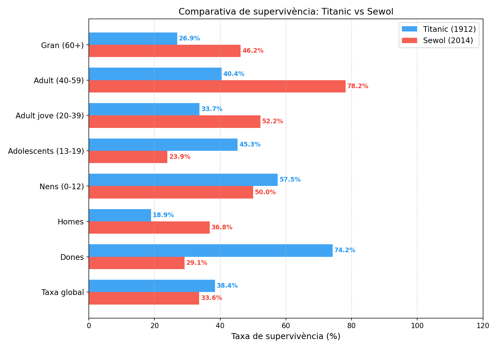

<p class="fig-title">Radar comparativo: Titanic vs Sewol</p>

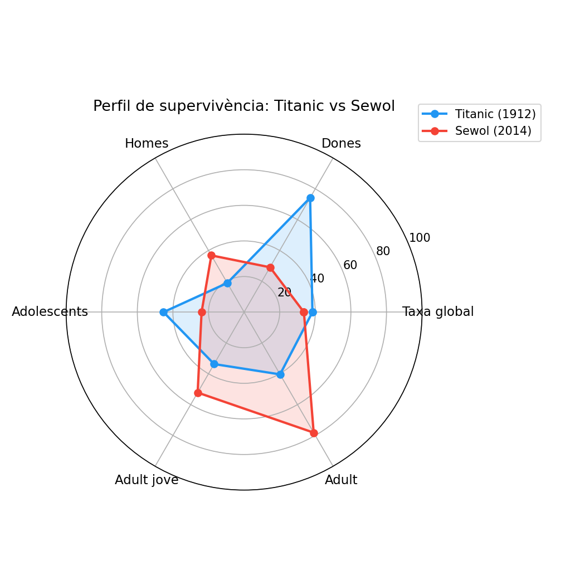

---

## 7. Conclusiones

### 7.1 Respuesta a la pregunta de investigación

1. **El protocolo de evacuación determina los patrones de supervivencia por encima de las variables sociodemográficas.** En el Titanic, el género fue el factor más determinante (ratio 3,93x). En el Sewol, este factor se invierte (ratio 0,79x): la variable género no operó de la misma manera en ausencia de un protocolo explícito de prioridad.

2. **La edad tuvo impactos opuestos en los dos desastres.** En el Titanic, los grupos de menor edad sobrevivieron más. En el Sewol, los adolescentes —la mayoría a bordo— tuvieron la tasa más baja (23,9%), mientras que los adultos mayores sobrevivieron mucho más (78,2%). Esto es consistente con la hipótesis de que los estudiantes siguieron las instrucciones de permanecer en los camarotes mientras que los adultos actuaron de manera más autónoma.

3. **Las tasas globales similares (38,4% vs 33,6%) esconden patrones internos radicalmente divergentes.** Una comparativa superficial podría concluir que los dos desastres tuvieron resultados similares; el análisis por subgrupos revela que los mecanismos fueron completamente diferentes.

4. **El perfil de máximo riesgo es diferente en cada desastre.** En el Titanic: hombre, tercera clase, adulto mayor. En el Sewol: adolescente, independientemente del género.

### 7.2 Limitaciones del análisis

- El grupo de niños en el Sewol (n=4) no permite ninguna inferencia estadística válida.
- No disponemos de datos sobre la ubicación exacta de cada pasajero en el momento del accidente.
- Los datos del Sewol no incluyen información sobre clase o nivel socioeconómico.
- Los dos desastres están separados por más de 100 años y se produjeron en contextos culturales y geográficos muy diferentes.

---

## 8. Outputs Generados

### 8.1 Dataset combinado

Fichero: `output/comparativa_titanic_sewol.csv` — 1.334 registros con las columnas normalizadas: `disaster`, `gender`, `age`, `survived`, `role`.

#### Script — Guardado del dataset combinado

```python
combined.to_csv('../output/comparativa_titanic_sewol.csv', index=False)

print('Fichero guardado: output/comparativa_titanic_sewol.csv')
print(f'Total registros: {len(combined)}')
print(f'  Titanic (train): {len(combined[combined["disaster"] == "titanic"])}')
print(f'  Sewol:           {len(combined[combined["disaster"] == "sewol"])}')
print('Columnas:', list(combined.columns))
```

### 8.2 Visualizaciones

| Fichero | Descripción |
|---------|-------------|
| `output/comparativa_genere_titanic_sewol.png` | Barras agrupadas: supervivencia por género y desastre |
| `output/comparativa_edat_titanic_sewol.png` | Líneas: supervivencia por franja de edad y desastre |
| `output/ratio_genere_titanic_sewol.png` | Barras: ratio mujeres/hombres por desastre |
| `output/ratio_nens_adults_titanic_sewol.png` | Barras: supervivencia niños vs adultos |
| `output/barres_comparativa_titanic_sewol.png` | Barras horizontales: tabla comparativa visual |
| `output/radar_titanic_sewol.png` | Radar: comparativa multidimensional |

---

## 9. Tecnologías — Bloque II

| Herramienta | Versión | Uso |
|-------------|---------|-----|
| **Python** | 3.14.0 | Lenguaje principal |
| **pandas** | 3.0.3 | Manipulación y normalización de datos |
| **NumPy** | 2.4.5 | Operaciones numéricas |
| **matplotlib** | — | Visualizaciones |
| **Jupyter Notebook** | — | Entorno de desarrollo |
